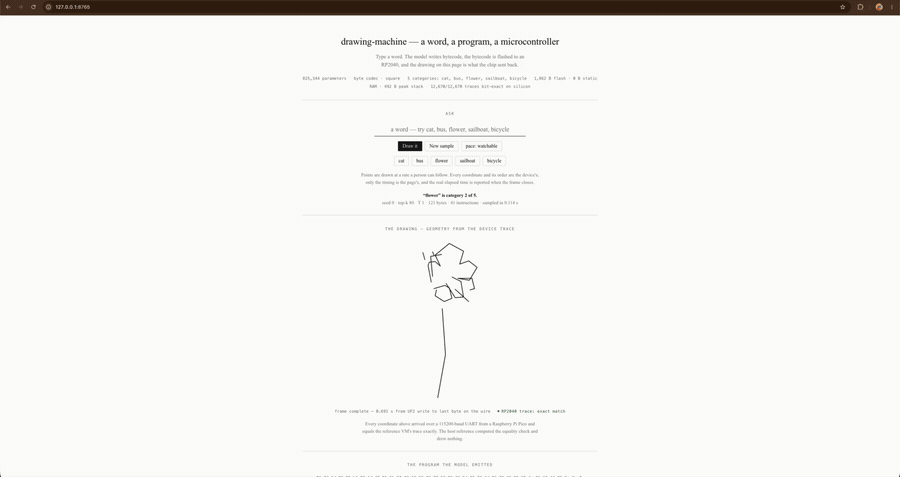
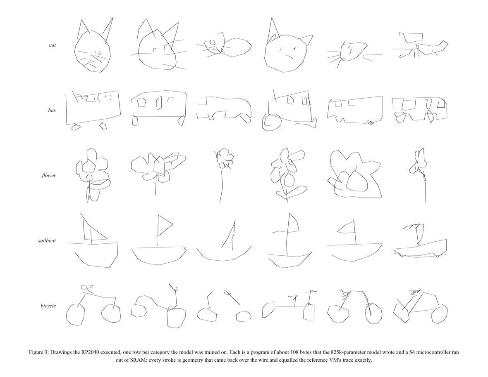
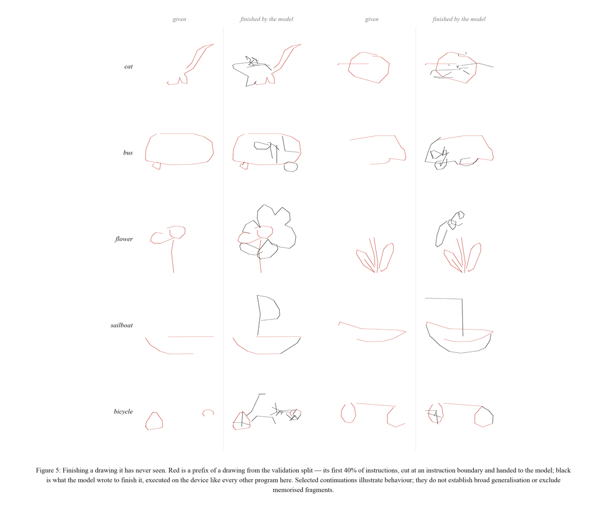
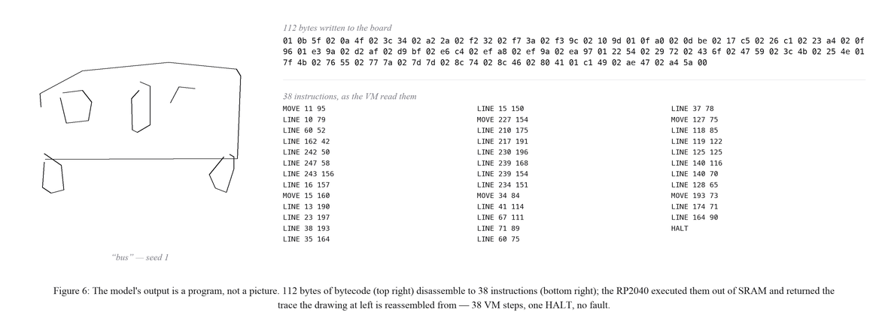

# drawing-machine

Small models that write drawing programs, and a tiny machine that runs them.

I'm interested in what a small model learns when its output is an executable
language rather than an image. This project is where I've been testing that:
mostly sub-million-parameter transformers, a drawing language with lines,
curves, loops and integer transforms, and a VM small enough to run on a
Raspberry Pi Pico.



The model runs on the host. It writes bytecode; the Pico executes it and sends
coordinates back over UART. What appears on screen comes from that returned
trace, checked against a Python reference VM. The demo model has 825,344
parameters and knows five categories: cat, bus, flower, sailboat and bicycle.
It's not an open-ended text-to-image model.

That split is deliberate. A small transformer keeps training experiments
manageable; a much smaller interpreter makes the resulting programs portable.
The Pico needs no model weights or tensor runtime. Geometry is exact fixed
point, nesting is bounded, execution has a fuel limit, and points stream out
without keeping a whole drawing in memory.

The interpreter takes **1,862 bytes of flash and 492 bytes of peak stack**, with
no static RAM. That's the VM alone, not bytecode storage or the transport
harness. The [hardware sweep](docs/claim4-bringup.md) matched **12,670 out of
12,670 traces** exactly. This is model-generated code running on a
microcontroller, not neural inference on the Pico.



The research has been less straightforward than getting drawings onto the
board. Changing the alphabet from bytes to bits barely mattered on synthetic
programs, but cost about 12 bits per drawing on QuickDraw. A hierarchical
planner improved termination while losing on likelihood. Both were useful
reminders that better prediction and better generation aren't the same thing.
The [representation](docs/results.md) and [factorisation](docs/claim3.md)
write-ups keep the numbers and experimental conditions.

That gap became more interesting with repeated shapes. Models learn to prefer
a continuation compatible with their prefix, yet rarely finish an exactly
compatible shape when generating freely: roughly 1% on the tested shape cases.
The [context experiments](docs/context.md) try to separate that from memorising
positions or recognising familiar motifs. I also tried
[gated latent feedback](docs/feedback-stability.md); that implementation failed
its stability gates before reaching the relation tests.



Current work is on [`copy-relation`](https://github.com/roodriigoooo/drawing-machine/tree/copy-relation):
giving the model an explicit source-span and affine-copy action alongside
ordinary byte emission. If it can recognise a relation, can making that
relation executable help it follow through? No learned result yet. `main`
keeps the completed experiments and device demo.

## Running it

Python 3.11+. No board, dataset or checkpoint needed for the VM:

```bash
python3 -m venv .venv
source .venv/bin/activate
python -m pip install -e .
```

```python
from pathlib import Path

from dm.isa.asm import assemble
from dm.vm.interp import VM
from dm.vm.render import to_svg

program = assemble("""
MOVE 64 64
LINE 192 64
LINE 192 192
LINE 64 192
LINE 64 64
HALT
""")
trace = VM().run(program)
assert trace.fault is None
Path("drawing.svg").write_text(to_svg(trace))
```

For models, tests and the recorded demo:

```bash
python -m pip install -e '.[train,eval,dev]'
python -m pytest -q -rs
python scripts/demo.py gallery --silicon-only
```

Open `artifacts/demo/gallery.html` to replay the saved device captures. Live
generation needs a checkpoint, which isn't bundled; the [demo notes](docs/demo.md)
cover that path. These commands don't write to a board. Some tests need optional
data or toolchains and report skips when those aren't available.



The Python implementation is in `dm/`, the C VM in `port/`, and experiment
scripts in `scripts/`. The longer studies in `docs/` include failed approaches
and corrections. Datasets, checkpoints and generated run logs stay outside Git.

Much of this builds on sketch-rnn, graphics program induction, and the work of
the Quick, Draw! contributors and Tabler Icons authors.
[References](docs/references.md) give the connections.

[MIT](LICENSE) for original code; dataset-derived material retains its
[upstream terms](THIRD_PARTY_NOTICES.md).
