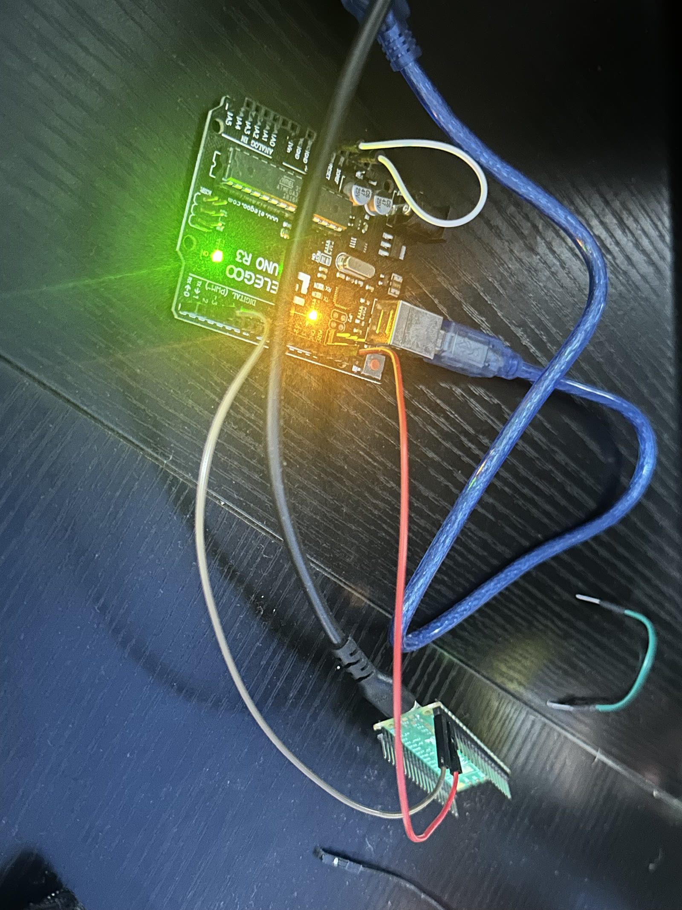

# Drawing programs on a Pico

The demo separates **generation on a host** from **execution on a microcontroller**:

```text
category → host transformer → bytecode → RP2040 VM → UART trace → browser
                                            ↓
                               checked against Python reference
```

The transformer has 825,344 parameters and was trained for 24,000 steps on five
QuickDraw categories: cat, bus, flower, sailboat and bicycle. A small explicit
synonym table routes inputs; unsupported words are refused. This is category
conditioning, not general language understanding.

## Why this architecture

Small neural models keep training experiments manageable. The device-side
language serves a different goal: compact executable output with a small,
predictable runtime. The Pico stores and interprets bytecode, not model weights.
It needs neither a tensor library nor floating-point hardware.

The C VM uses exact fixed-point geometry, bounded control/transform stacks,
a fuel limit and streamed output points. Interpreter memory therefore does not
grow with drawing length. Input storage, transport and any consumer-side
buffering are separate costs. The measured ISA-v2 interpreter footprint is
1,862 bytes of flash, zero static RAM and 492 bytes peak stack; these are **not**
the footprint of the complete demo firmware.

This split makes generated programs usable on constrained hardware. It does
not demonstrate autonomous generation without a host, nor establish an energy
advantage over alternative architectures. [Hardware evidence](claim4-bringup.md)
describes what was measured.

## Replay without hardware

From the repository root, with training dependencies installed:

```bash
python scripts/demo.py gallery --silicon-only
```

Open `artifacts/demo/gallery.html`. The generated page replays saved captures;
it does not generate new drawings or communicate with a board.

The repository contains **60 RP2040 captures**, including **20 prefix
continuations**. Every capture records `source: "rp2040"` and a successful
reference-equality check. Public records differ from private originals only in
`checkpoint.path`, normalized to `runs/<filename>`; original and public hashes
are listed in `artifacts/demo/publication.json`.

## Live generation and native rehearsal

Live generation requires a trained checkpoint, which is not bundled. Inspect
available commands before configuring a board:

```bash
python scripts/demo.py --help
python scripts/demo.py live --help
python scripts/demo.py capture --help
python scripts/demo.py figures --help
```

`--native` uses the native C execution path instead of the RP2040 and is
explicitly labelled as rehearsal. It cannot earn the silicon badge.
Hardware commands load a RAM image onto a connected board; they are not part of
the installation or quick start. See the [bring-up record](claim4-bringup.md)
for wiring, startup checks and electrical precautions.

## What the pictures show



The still figures are generated from captured records:

| Figure | Meaning | Limit |
|---|---|---|
| [Gallery](media/gallery.png) | Generated programs executed on RP2040 | Selected examples, not a quality estimate |
| [Nearest neighbours](media/novelty.png) | Comparison with sampled training drawings | Does not prove absence of memorisation |
| [Prefix continuations](media/prefix.png) | Completion of held-out drawing prefixes | Does not establish broad generalisation |
| [Program](media/program.png) | Bytecode alongside its executed geometry | Host computes instruction highlighting |

Black geometry comes from the parsed device trace. Grey comparisons come from
training drawings rendered on the host. Red marks the supplied human prefix.
The host reference VM checks equality but never substitutes displayed device
geometry. A mismatch or incomplete capture fails rather than falling back.

The equality badge requires **both** RP2040 provenance and a successful
reference comparison. `tests/test_demo.py` checks this boundary. The demo
supports the execution claim; model quality needs the separate
[conditioning evaluation](conditioning.md).
