# Hypotheses and Results

Small neural networks write drawing programs, and a tiny virtual machine executes them on hardware. At sub-million-parameter budgets, representational choices dominate architecture: how coordinates, opcodes, and program hierarchies are encoded matters more than layer tweaks.

This document brings together the core hypotheses, experimental setups, and empirical findings across the project. It replaces scattered run logs with a single, consolidated record.

---

## 1. Claim 1: Drawing Representation and Alphabet Granularity

### Hypothesis
Token, byte, and bit encodings of an identical drawing bytecode differ only in how much structure the alphabet provides. At sub-1M parameters, which representation a model prefers is measurable and directly affects performance.

### Experimental Design
We evaluated four independent, unconfounded axes across two corpora:
- **Typing:** `token` (269 symbols) vs `byte` (258 symbols). Isolates one bit per position: is this symbol an opcode?
- **Granularity:** `byte` (8-bit alphabet) vs `bit` (2 symbols: 0 and 1, plus BOS/EOS). Tests field-width and byte-boundary discovery over 8x longer sequences.
- **Fusion:** `token` vs `token_typed` (fused opcodes and operand kinds, expanding vocabulary from 269 to 1,293+). Tests whether pre-binding argument roles helps or wastes parameter capacity.
- **Relativity:** absolute coordinates vs relative deltas from the pen. An exact mod-256 bijection that preserves identical information while testing coordinate frame locality.

Models were evaluated across three training regimes: token-matched (fixed token budget), step-matched (fixed optimizer steps), and converged (trained to asymptotic loss, 24,000 steps). Evaluation used paired difference in test loss measured in bits per drawing.

### Findings

| Axis | Corpus | Outcome | Effect (bits/drawing) | Verdict |
|---|---|---|---|---|
| Granularity (`bit` vs `byte`) | Synthetic (Tier A) | Equivalent | -0.67 ± 0.77 | Free representation on 4% fewer parameters |
| Granularity (`bit` vs `byte`) | QuickDraw (Tier B multi) | Severe penalty | +11.58 ± 0.60 | Corpus dependent; 5x the noise floor |
| Fusion (`token_typed` vs `token`) | Synthetic (wide shape) | Severe penalty | +4.87 ± 2.18 | Inflates embedding table to 22% of model parameters |
| Fusion (`token_typed` vs `token`) | Synthetic (deep shape) | Neutral | -0.07 | Deep models absorb large vocabularies better |
| Relativity (`delta` vs `abs`) | QuickDraw | Invariance | 1 coordinate pair moved | Translating a drawing moves 1 pair instead of all coordinates |

[](figs/fig1_granularity.svg)

1. **The granularity result depends on the corpus.** On simple synthetic curves, a two-symbol bit alphabet performs identically to a byte alphabet (-0.67 ± 0.77 bits/drawing), saving embedding parameters. On diverse human sketches from QuickDraw, the exact same bit arm incurs an 11.58-bit penalty. Either number in isolation is an artifact; the pair is the result.
2. **Bits cost 8x in inference runtime.** The bit alphabet requires 254 million tokens of evaluation versus 32 million for bytes (48 minutes versus 4 minutes).
3. **Likelihood dissociates from sampling quality.** On synthetic data, the bit arm achieved the lowest test loss and perfect bytecode validity, but produced severely truncated drawings (median 25 bytes against a ground truth of 41 bytes). This stems from an instruction-boundary halting hazard: predicting end-of-program receives an over-concentrated probability mass at byte boundaries.
4. **Fused tokenization is unaffordable at small scale.** In standard architectures (like IconShop), fusing opcode and coordinate values into combined tokens blows up the vocabulary. In our wide model (2 layers, d=192), the embedding table devoured 22% of total parameter budget and lost 4.87 bits/drawing. Only deep, narrow models could absorb the parameter overhead.

---

## 2. Claim 2: Structure Discovery and Repetition

### Hypothesis
A transformer trained exclusively on flat execution traces (linear sequences of `MOVE` and `LINE`) can discover latent geometric regularity and recover `REPEAT` loop structure without explicit grammar supervision.

### Experimental Design
We constructed synthetic training programs containing repeated geometric motifs translated along a regular vector. We measured the L0 to L1 compression ratio (the recovery metric), comparing how closely the model's likelihood on flat repetitive traces matches an oracle provided with an explicit `REPEAT` loop.

### Findings

| Metric | Seed 0 | Seed 1 | Delta | Note |
|---|---|---|---|---|
| `recovery` | +0.8068 | +0.7836 | 0.023 | Replicates across seeds |
| Copy 1 (reference) | 1.8165 | 1.7948 | 0.022 | Ground truth motif cost (bits/symbol) |
| Copy 2 | 0.4695 | 0.4983 | 0.029 | 74% collapse in surprise |
| Copy 3 | 0.2098 | 0.2572 | 0.047 | Minimum surprise |
| Copy 4 (trained bound) | 0.2707 | 0.3147 | 0.044 | Retains low surprise |
| Copy 5 (out of count) | 1.4775 | 0.9466 | 0.531 | Fails immediately; seed divergence |

1. **In-distribution repetition is discovered.** The model achieved a recovery score of +0.807, compressing 22.75 out of 28.20 available bits per drawing.
2. **Translation inference happens at copy 2.** Surprise plummets by 74% on the second repetition. The model recognizes the shape prefix, identifies the offset vector, and predicts subsequent copies with minimal loss.
3. **The model learns a count prior, not an abstract rule.** Performance collapses immediately at copy 5, exactly one step beyond the maximum count present in training. The failure is driven by an inability to extrapolate loop counts rather than coordinate degradation. Furthermore, out-of-count behavior diverged substantially between random seeds (0.95 vs 1.48 bits/symbol), confirming that out-of-distribution continuation is ungrounded.

---

## 3. Claim 3: Factorisation, Stroke Planning, and Diffusion

### Hypothesis and Motivation
At sub-1M parameters, flat autoregression struggles with global composition because it predicts all tokens at uniform resolution. Denoising diffusion decomposes naturally by scale: high-noise steps capture global layout and coarse placement, while low-noise steps resolve local stroke curvature.

A two-level factorisation (a non-autoregressive stroke planner generating stroke bounding boxes, paired with an autoregressive stroke decoder emitting bytes) should beat flat autoregression at matched parameter budgets. Moreover, scale separation should enable level-specific training: coarse layout on small, scarce composition datasets, and fine stroke dynamics on large QuickDraw collections.

### Experimental Design
We implemented a hierarchical model:
- **Top level (Planner):** Predicts stroke summaries (bounding boxes, center coordinates, and style latents). We compared two top-level mechanisms: continuous diffusion denoising and discrete autoregression over stroke summaries.
- **Bottom level (Decoder):** Autoregressively generates intra-stroke bytecode conditioned on the top-level stroke summary.

We benchmarked this hierarchical pipeline against parameter-matched flat autoregressive models on QuickDraw across two compute budgets.

### Findings

| Architecture | Model Parameters | Test Loss (bits/drawing) | Termination Gap (len EMD) |
|---|---|---|---|
| Flat Autoregressive baseline | 825,344 | 489.2 (converged) | 7.0–13.6 bytes |
| Hierarchical (AR planner + AR decoder) | 825,344 | +39.82 to +55.54 bits worse | 1.8–3.2 bytes (superior) |
| Hierarchical (Diffusion planner + AR decoder) | 825,344 | +41.15 to +53.20 bits worse | 2.1–3.5 bytes (superior) |

1. **Refuted on likelihood.** The stroke planner fell behind the flat autoregressive baseline by approximately 40 to 50 bits per drawing. Scaling parameters helped minimally, closing the gap at only 5.5 bits per doubling.
2. **The likelihood penalty is a modeling loss, not redundant conditioning.** The stroke decoder spent only 0.035 bits per drawing on fixed-geometry slots where its summary allowed only one legal value (compared to 88.15 bits for the unconditioned flat model). The factorisation was not paying twice for its own conditioning. Instead, it lost 8.6 to 9.9 bits directly on coordinate extent modeling.
3. **Supported on termination and length fidelity.** Flat autoregressive models frequently suffer from premature halting or run away to maximum sequence length. The hierarchical planner decoupled sequence length from stroke generation, matching the ground-truth length distribution significantly better (Earth Mover's Distance of ~2 bytes vs ~10 bytes for flat models).
4. **Diffusion tied with autoregression.** When evaluated on the same summary grid, composition-level diffusion achieved near-identical likelihood to composition-level autoregression. The termination benefits came entirely from introducing an explicit two-level hierarchy, not from the diffusion denoising objective itself.

---

## 4. Claim 4: Microcontroller Execution on Silicon

### Hypothesis
Bytecode emitted by a small host model can execute deterministically on a resource-constrained microcontroller (Cortex-M0+) within strict flash and RAM budgets, maintaining bit-exact equivalence with the host reference engine.

### Architecture and Exactness
The system splits neural generation from deterministic execution:
- The neural network runs exclusively on the host. It generates drawing bytecode.
- The microcontroller (Raspberry Pi Pico, RP2040) contains only the virtual machine interpreter. It executes bytecode and streams coordinate vertices back over a 115200-baud UART interface.

```text
Prompt -> Host Transformer -> Bytecode -> RP2040 Pico VM -> UART Trace -> Display
                                                |
                                    Verified bit-exact against
                                        Python Reference VM
```

The Cortex-M0+ lacks a floating-point unit (FPU). Rather than introducing floating-point emulation or imprecise fixed-point heuristics, the virtual machine exploits an exact mathematical property of Bezier curves. With curve evaluation steps set to a power of two ($S = 2^k$), the cubic Bernstein coefficients ($u^3, 3u^2t, 3ut^2, t^3$) are exact binary fractions with denominator $S^3$. By setting `DM_FRAC_BITS = 3 * log2(S)`, coordinate calculation requires only integer arithmetic with no division or rounding error.

### Silicon Measurements (RP2040 at 12 MHz)

| Metric | Target / Budget | Measured Silicon Result | Status |
|---|---|---|---|
| Trace Exactness | Bit-identical to host VM | 12,670 / 12,670 traces match | Bit-exact (zero tolerance) |
| Flash Memory | ≤ 16 KB | 1,862 bytes | Passes comfortably |
| Static RAM | ≤ 2 KB | 0 bytes | Zero static allocation |
| Peak Stack Memory | ≤ 1 KB | 492 bytes | Bounded call/transform stack |
| Execution Speed | Real-time interactive | 7,334 cycles / drawing (0.611 ms) | 1.959 cycles / instruction |
| Conformance Suite | 100% pass | 120 / 120 programs passing | Validated against QEMU baseline |

1. **Bit-exact equivalence.** In a hardware sweep of 12,670 test programs, the microcontroller output matched the Python reference VM bit for bit. The conformance test enforces an exact equality check with zero numerical tolerance.
2. **Minimal resource consumption.** The compiled interpreter requires under 2 KB of flash and less than 500 bytes of stack RAM. Stack depth is strictly bounded by hardware execution fuel limits and shallow call stacks.
3. **Hardware-specific defects.** Running on physical silicon exposed real device issues that host-side functional simulations missed, including peripheral clock initialization races (`clk_peri` reset delays) during bare-metal startup.
4. **Energy consumption.** Joules per drawing was explicitly descoped due to lack of on-bench current sensing hardware.

---

## 5. Class Conditioning and Controllability

### Hypothesis and Theoretical Bound
Providing explicit class labels to the model enables prompted drawing generation (for example, "draw a cat" vs "draw a bicycle"). However, information theory dictates that class conditioning can improve test likelihood by at most the mutual information between image and class:

$$I(X; C) = H(C) - H(C \mid X) \le H(C) = \log_2(5) \approx 2.32\text{ bits}$$

Because run-to-run variance on QuickDraw is roughly 2.5 bits, a two-model comparison (conditional loss minus unconditional loss) is dominated by training run noise.

### Solution: Single-Model Bayes Evaluation
Instead of differencing two separate training runs, we evaluate conditioning inside a single conditional model. By scoring validation drawings under all five candidate classes, Bayes' rule yields:

$$p(c \mid x) \propto p(x \mid c) \cdot p(c)$$

This turns the generative model into a zero-cost classifier without requiring separate discriminative weights or cross-model subtraction.

### Findings
1. **Generative classification matches dedicated classifiers.** The single-model Bayes classifier achieves robust class discrimination across all five target categories (cat, bus, flower, sailboat, bicycle).
2. **Effective geometric steering.** Category conditioning successfully controls geometry at or above the dataset's own category separation, enabling reliable prompt-directed drawing generation on the host.

---

## 6. Follow-up Structural Directions

### Affine Transforms and Orbits (`XFORM`)
We extended the instruction set with `XFORM` and `REPEATX` to support 2D transformations (dihedral group D4: rotations, reflections, and integer translations).
- **Orbit discovery:** The model discovers transformed repetitions just as easily as translations, achieving a recovery score of +0.960.
- **Direct vs indirect compression:** `REPEATX` directly folds 40.9% of corpus bytecode bytes but only 1.2% of bits (+5.84 bits/drawing), because the model already assigned very low surprise to repeated geometry. However, shorter sequences yielded an indirect context benefit of +19.8 bits/drawing (+4.1%).
- **Termination improvements:** The largest practical win appeared in length control: generated program lengths stayed within 9% to 11% of ground-truth distributions, compared to 41% to 112% errors for flat models.

[](figs/fig9_transform_recovery.svg)

### Causal Context and Compatibility
We examined whether models utilize geometric context from preceding strokes to select compatible continuations.
- **Teacher-forced preference:** Under teacher-forced evaluation, models exhibited a massive preference for geometrically compatible stroke continuations (+4.28 bits per target byte, Holm p = 0.001). Rigorous controls verified that this was not an artifact of distance, proximity heuristics, token frequency, or bag-of-coordinates matching.
- **The generation disconnect:** Despite strong conditional preferences in teacher forcing, models struggled to complete compatible geometry when sampling freely, succeeding only ~1% of the time on composed shapes and 7% to 13% on flat steps. The model knows which continuation is right when shown, but cannot reliably produce it during unguided generation.

[](figs/fig15_context_generation.svg)

### Gated Latent Feedback
We tested multi-pass recurrent latent feedback (feeding processed top-layer representations back into shallow layers) to see if computational looping could resolve relations better than feedforward depth.
- At our sub-1M parameter scale, the recurrent operator failed generic stability and bounded-norm checks across all tested schedules.
- Following pre-registered experimental stopping criteria, the direction was formally closed rather than endlessly retuned.

---

## 7. Summary of Empirical Findings

| Area | Core Question | Primary Result | Key Number |
|---|---|---|---|
| **Claim 1: Representation** | Do bit, byte, and token alphabets perform equally? | No; performance depends heavily on the corpus. Bit alphabet is free on synthetic data but degrades significantly on complex sketches. | -0.67 bits (synthetic) vs +11.58 bits (QuickDraw) |
| **Claim 2: Discovery** | Can an autoregressive model discover loops from flat traces? | Yes, within trained repetition counts. Extrapolation past the trained count fails. | Recovery score +0.807; collapses at copy 5 |
| **Claim 3: Hierarchy** | Does a hierarchical stroke planner beat flat autoregression? | Refuted on likelihood; strongly supported on termination and length distribution. | -40 to -50 bits likelihood; length EMD drops from 10 to 2 bytes |
| **Claim 4: Silicon VM** | Can drawing bytecode execute deterministically on an RP2040? | Yes. Bit-exact integer geometry without FPU or float emulation. | 1,862 bytes flash, 0 RAM, 12,670/12,670 exact traces |
| **Conditioning** | Can class labels steer geometry effectively? | Yes. Single-model Bayes evaluation bypasses resolution floor; enables clean generation. | Theoretical bound $I(X; C) \le 2.32$ bits |
| **Transforms** | Do explicit affine loop opcodes improve generation? | Minor direct bit compression, but dramatic improvement in sequence termination. | Length error reduced from 112% to 11% |
| **Causal Context** | Does strong conditional context translate to free generation? | No. Strong preference under teacher forcing does not yield reliable free completion. | +4.28 bits/byte preference vs ~1% exact free generation |
